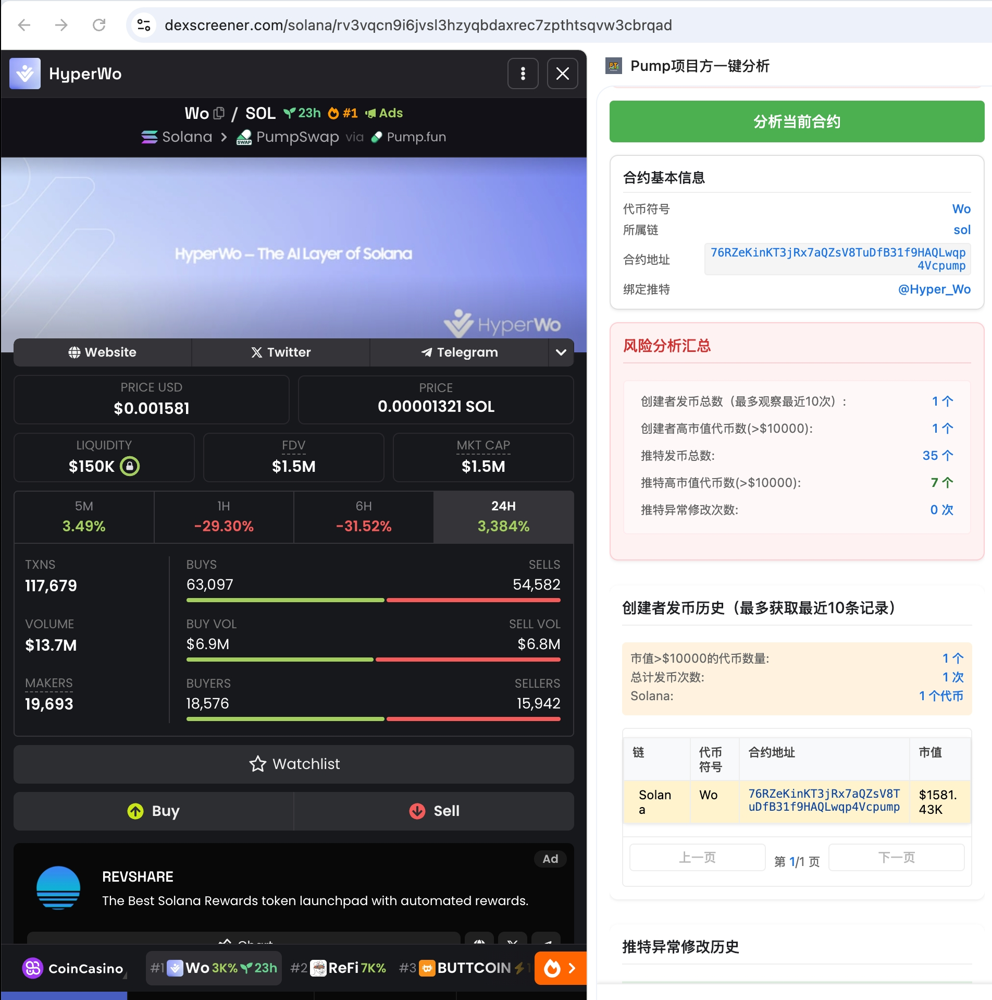
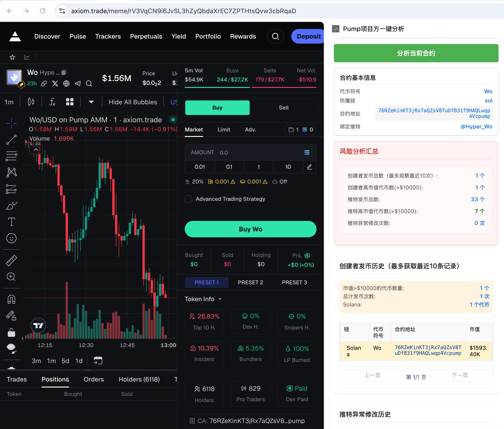
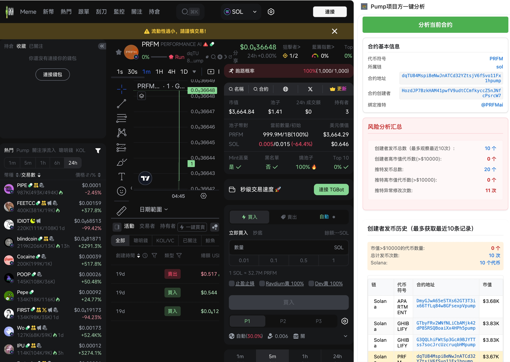

# 🚀 Pump Owner Analysis

<div align="center">
  
  
  
</div>

> 一个强大的代币创建者分析工具，帮助您快速识别和分析代币项目方的历史记录和潜在风险。

## 📞 联系我们

<div align="center">
  <a href="https://pumptools.me/">
    
  </a>
  <a href="https://x.com/pumptools_me">
    
  </a>
  <a href="https://t.me/pumptools_me">
    
  </a>
</div>

## 📺 使用示例

<div align="center">
  
[](https://www.youtube.com/watch?v=4cOJl88uaEw "Pump项目方一键分析插件使用教程")

<p><i>👆 点击观看视频教程</i></p>
</div>

## 🖼️ 插件展示

<div align="center">
  <table>
    <tr>
      <td></td>
      <td></td>
      <td></td>
    </tr>
    <tr>
      <td align="center">插件在 DexScreener 平台展示</td>
      <td align="center">插件在 Axiom 平台展示</td>
      <td align="center">插件在 GMGN 平台展示</td>
    </tr>
  </table>
</div>

## ✨ 功能特点

- 🔍 **代币创建者分析**：深入分析代币创建者的历史记录和背景信息
- 📊 **发币历史追踪**：追踪项目方的发币历史，识别潜在风险
- 🐦 **推特账号监控**：监控项目方推特账号的活动和异常行为
- ⚠️ **异常行为检测**：智能识别项目方的可疑操作和异常行为
- ⛓️ **多链支持**：支持 Solana、BNB Chain 等多个区块链网络
- 👑 **会员特权**：提供更多高级功能和数据分析

## 🚀 快速开始

### 1️⃣ 下载插件
- 点击页面右上角的绿色 "Code" 按钮
- 选择 "Download ZIP" 下载完整代码包
- 解压到本地文件夹

### 2️⃣ 安装插件
1. 打开 Chrome 浏览器
2. 访问 `chrome://extensions/`
3. 开启右上角的"开发者模式"
4. 点击"加载已解压的扩展程序"
5. 选择解压后的项目文件夹

### 3️⃣ 开始使用
- 在 Chrome 工具栏中找到 "Pump项目方一键分析" 插件
- 点击插件图标打开侧边栏
- 按照界面指引完成设置
- 开始分析代币项目方信息

## 🛠️ 技术架构

```
pump_owner_analysis/
├── analyzers/           # 分析器模块
│   ├── dexscreener-analyzer.js
│   ├── axiom-analyzer.js
│   └── gmgn-analyzer.js
├── membership.js        # 会员系统
├── analyzer-rules.js    # 分析规则
├── sidepanel.html       # 侧边栏界面
└── config.js           # 配置文件
```

## 🤝 参与贡献

我们欢迎各种形式的贡献！您可以通过以下方式参与：

- 提交 Issue 报告问题
- 提交 Pull Request 改进代码
- 分享使用经验
- 提出新功能建议

## 📄 许可证

本项目采用 [MIT License](LICENSE) 开源协议。

---

<div align="center">
  <sub>Built with ❤️ by PumpTools Team</sub>
</div>
